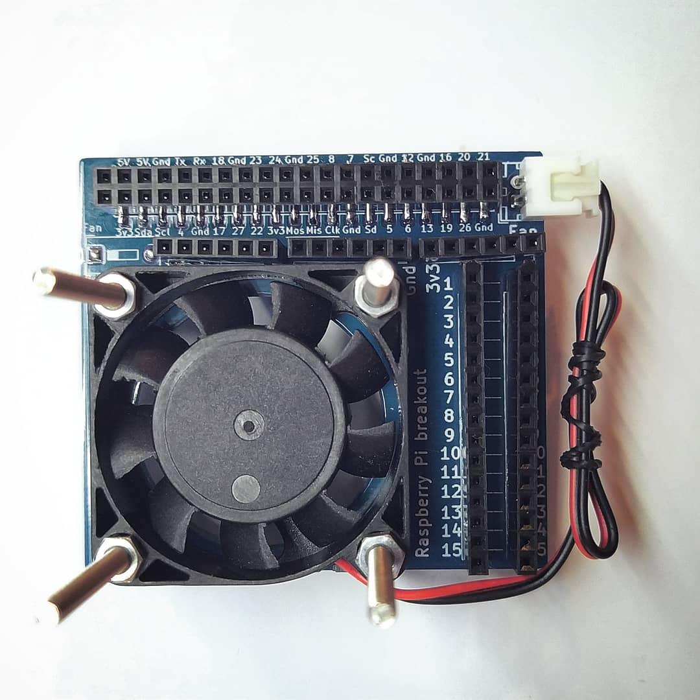
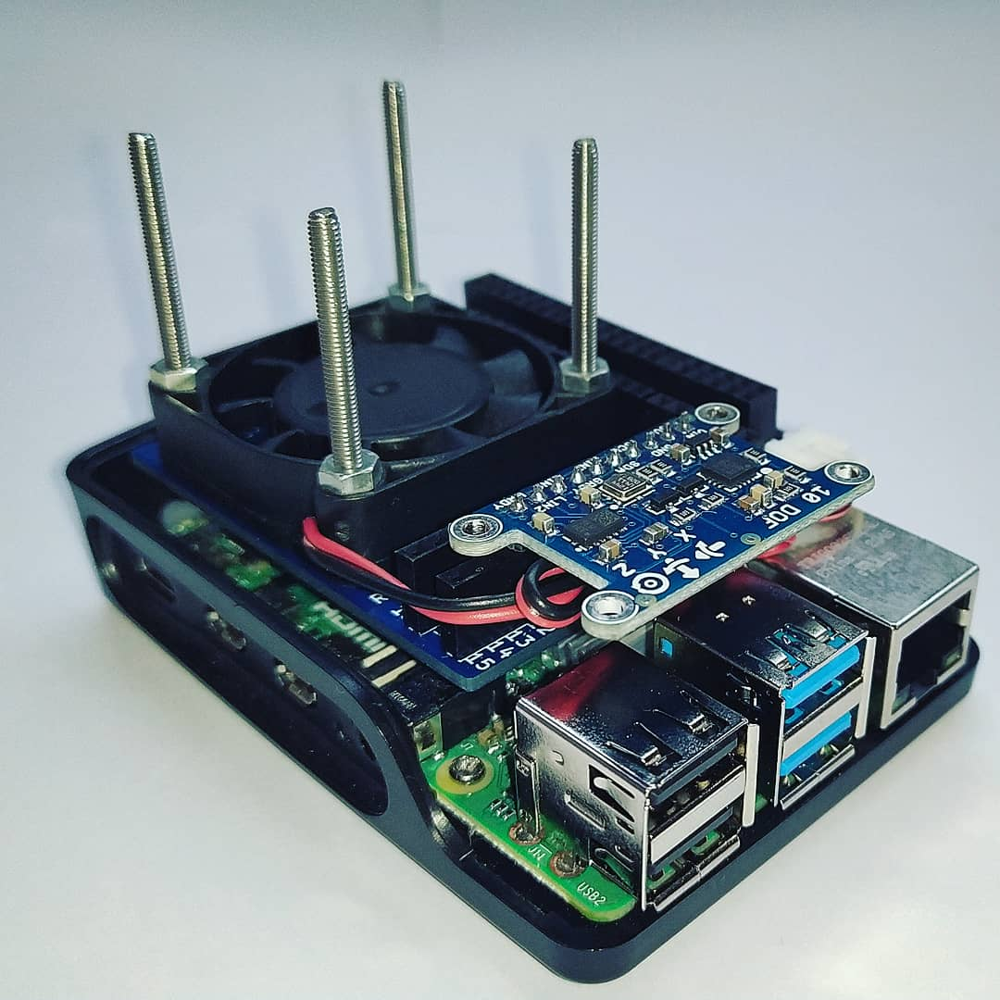

# Raspberry-Pi-Fan-Breakout

  

Compact and lightweight Raspberry Pi breakout board design with fan onboard.

### Breakout 3D model

### Assembled top view

### Breakout on top of Raspberry Pi 4 with IMU sensor attached
